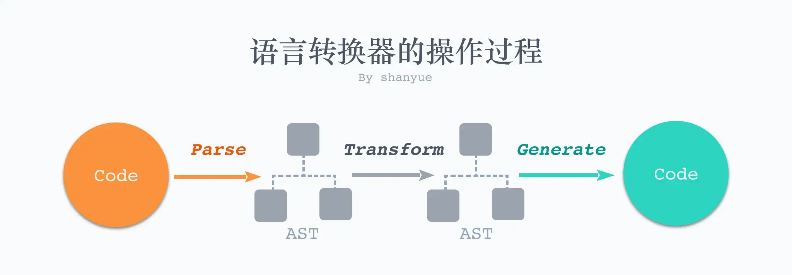

# cjs 模块收集与 ast

## 1. AST 概念

    AST(Abstract Syntax Tree) 抽象语法树, 他的作用有:

    1. 如何将 Typescript 转化为 Javascript (typescript)
    2. 如何将 SASS/LESS 转化为 CSS (sass/less)
    3. 如何将 ES6+ 转化为 ES5 (babel)
    4. 如何将 Javascript 代码进行格式化 (eslint/prettier)
    5. 如何识别 React 项目中的 JSX (babel)
    6. GraphQL、MDX、Vue SFC 等等
       而在语言转换的过程中，实质上就是对其 AST 的操作，核心步骤就是 AST 三步走
    7. Code -> AST (Parse)
    8. AST -> AST (Transform)
    9. AST -> Code (Generate)



- 可以在[AST EXPLORER](https://astexplorer.net/#)这个网站编写并查看各个语言的 AST(不同的语言有不同的解析器)

## 2. Javascript/CSS 解析后的语法树:

- 这里的 AST 树是基于 acorn 解析的。

Javascript 代码:

```Javascript
  function sum (a,b){
    return a + b
  }
  sum(1,2)
```

转为 AST 后为:

```JSON
  {
"type": "Program",
"start": 0,
"end": 45,
"body": [
  {
    "type": "FunctionDeclaration",
    "start": 0,
    "end": 35,
    "id": {
      "type": "Identifier",
      "start": 9,
      "end": 12,
      "name": "sum"
    },
    "expression": false,
    "generator": false,
    "async": false,
    "params": [
      {
        "type": "Identifier",
        "start": 14,
        "end": 15,
        "name": "a"
      },
      {
        "type": "Identifier",
        "start": 16,
        "end": 17,
        "name": "b"
      }
    ],
    "body": {
      "type": "BlockStatement",
      "start": 18,
      "end": 35,
      "body": [
        {
          "type": "ReturnStatement",
          "start": 21,
          "end": 33,
          "argument": {
            "type": "BinaryExpression",
            "start": 28,
            "end": 33,
            "left": {
              "type": "Identifier",
              "start": 28,
              "end": 29,
              "name": "a"
            },
            "operator": "+",
            "right": {
              "type": "Identifier",
              "start": 32,
              "end": 33,
              "name": "b"
            }
          }
        }
      ]
    }
  },
  {
    "type": "ExpressionStatement",
    "start": 37,
    "end": 45,
    "expression": {
      "type": "CallExpression",
      "start": 37,
      "end": 45,
      "callee": {
        "type": "Identifier",
        "start": 37,
        "end": 40,
        "name": "sum"
      },
      "arguments": [
        {
          "type": "Literal",
          "start": 41,
          "end": 42,
          "value": 1,
          "raw": "1"
        },
        {
          "type": "Literal",
          "start": 43,
          "end": 44,
          "value": 2,
          "raw": "2"
        }
      ],
      "optional": false
    }
  }
],
"sourceType": "module"
}
```

CSS 代码:

```CSS
@media screen and (min-width: 480px) {
    body {
        background-color: lightgreen;
    }
}

#main {
    border: 1px solid black;
}

ul li {
	padding: 5px;
}

```

转化为 AST 后:

```JSON
{
  "parentStyleSheet": null,
  "cssRules": [
    {
      "parentRule": null,
      "parentStyleSheet": "[Circular ~]",
      "media": {
        "0": "screen and (min-width: 480px)",
        "length": 0
      },
      "cssRules": [
        {
          "parentRule": "[Circular ~.cssRules.0]",
          "parentStyleSheet": "[Circular ~]",
          "selectorText": "body",
          "style": {
            "0": "background-color",
            "length": 1,
            "parentRule": "[Circular ~.cssRules.0.cssRules.0]",
            "_importants": {
              "background-color": ""
            },
            "__starts": 48,
            "background-color": "lightgreen"
          },
          "__starts": 43,
          "__ends": 93
        }
      ],
      "__starts": 0,
      "__ends": 95
    },
    {
      "parentRule": null,
      "parentStyleSheet": "[Circular ~]",
      "selectorText": "#main",
      "style": {
        "0": "border",
        "length": 1,
        "parentRule": "[Circular ~.cssRules.1]",
        "_importants": {
          "border": ""
        },
        "__starts": 103,
        "border": "1px solid black"
      },
      "__starts": 97,
      "__ends": 135
    },
    {
      "parentRule": null,
      "parentStyleSheet": "[Circular ~]",
      "selectorText": "ul li",
      "style": {
        "0": "padding",
        "length": 1,
        "parentRule": "[Circular ~.cssRules.2]",
        "_importants": {
          "padding": ""
        },
        "__starts": 143,
        "padding": "5px"
      },
      "__starts": 137,
      "__ends": 161
    }
  ]
}
```

## 3. 如何根据入口文件搜索出所有需要打包的模块

我们将 `require('./a')` 转为 AST 观察。

```JSON
{
  "type": "Program",
  "start": 0,
  "end": 13,
  "body": [
    {
      "type": "ExpressionStatement",
      "start": 0,
      "end": 13,
      "expression": {
        "type": "CallExpression",
        "start": 0,
        "end": 13,
        "callee": {
          "type": "Identifier",
          "start": 0,
          "end": 7,
          "name": "require"
        },
        "arguments": [
          {
            "type": "Literal",
            "start": 8,
            "end": 12,
            "value": "./a",
            "raw": "'./a'"
          }
        ],
        "optional": false
      }
    }
  ],
  "sourceType": "module"
}
```

发现在 `expression` 中的 `arguments` 中就可以获取,其他解析器得到的 AST 都类似
如果我们将获取到的值即导入模块的相对路径记录下来:

```Javascript
{
    name: 'index.js',
    deps:[
      {
        name: 'A.js',
        deps:[
              {
                name:'B.js',
                deps:[]
              }
            ]
      },
      {
        name: 'A.js',
        deps:[]
      }
    ]
}
```

可以生成一个包含模块关系的依赖树,我们可以基于`babel`来实现一下这个功能: [getAstModules](./code/astExplorer.js)

## 4. 接下来实现一个 mini-webpack !

[mini-webpack](./code/mini-webpack.js)
